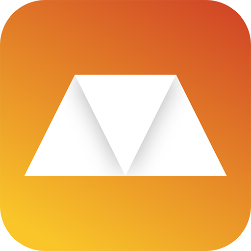

# [AudioVideoMerger](https://audiovideomerger.github.io)

AudioVideoMerger is a tool for painlessly replacing audio under video files.

- **Fast**: No re-encoding of the video.
- **Simple to use**: Drag 'n drop files onto the app's icon or in the UI.
- **Easy to install**: Uses `ffmpeg` and has it bundled so no need to manually install dependencies.
- **Process multiple files at once**: Select as many audio and video files you want: AudioVideoMerger will automatically create versions for each combination.

## In action 🎬

## Why? 🤨

I work in audio for video and we (and our clients) constantly put new versions of audio under a video, sometimes wanting to test many different audio tracks for the same video. Creating a new video every time is a hassle, especially in a video editor. This app is built to handle exactly that, in seconds, without the need to re-render, and by bundling `ffmpeg` we can now easily share it. It works exactly how we like it to work, and therefore is deliberately kept simple. (But feel free to [post an issue](https://github.com/kapoko/audio-video-merger/issues) if you have a suggestion on making this app fit more use cases!)

## Note on verification

This app isn't codesigend because it isn't registered through Apple's Developer program. This is why you see the message `“AudioVideoMerger.app” cannot be opened because the developer cannot be verified.` when opening the app for the first time. Go to _System Settings_ > _Privacy & Security_, scroll down and you should see a message that the app was blocked. From there click on `Open Anyway`, and you're good to go.

## Platforms 💻

Runs on macOS 10.11 (El Capitan) or higher.

## Download ⬇️

Head over to [audiovideomerger.github.io](https://audiovideomerger.github.io) to download the latest version.
